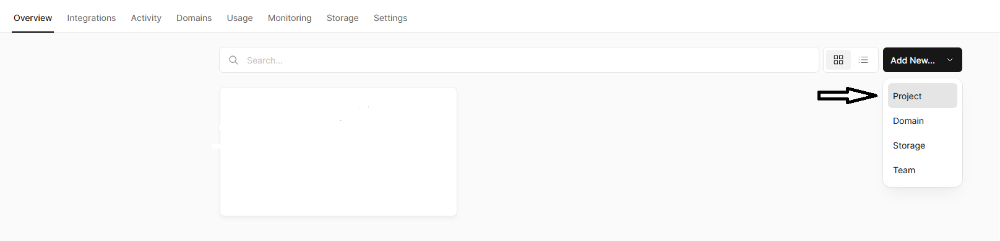
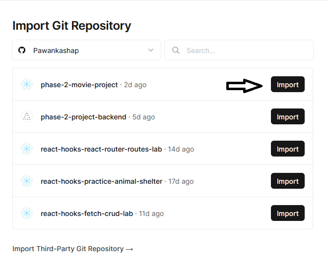

# The Movie Project

## Overview

The purpose of the that utilizes The Movie Database's internal API. The project showcases various movie details such as the movie image, name, release date, and genre. Users can create a customized movie list and filter their favorite movies. Additionally, users have the ability to edit movie details or delete movies they do not enjoy.


## Installing / Getting started

<!-- A quick introduction of the minimal setup you need to get a hello world up & running. -->

```shell

npx create-react-app phase-2-movie-project

cd phase-2-movie-project

npm install react-router-dom@5

npm start


```

npm start script is used to execute the defined file in it without typing its execution command. Package.json file. "scripts"{ "start":"node index.js" }.
React Router DOM is an npm package that enables you to implement dynamic routing in a web app. It allows you to display pages and allow users to navigate them.React Router DOM is an npm package that enables you to implement dynamic routing in a web app. It allows you to display pages and allow users to navigate them.


### Initial Configuration

### `npm test`

npm test is a shortened version of npm run test ; npm is running the test command as defined in the package. json configuration file. So to answer your question, no it's not the same thing. npm isn't doing any testing on it's own; it is merely running the mocha command for you.

### `npm i bootstrap@5.3.0`

Bootstrap uses NPM scripts for its build system. Our package. json includes convenient methods for working with the framework, including compiling code, running tests, and more. To use our build system and run our documentation locally, you'll need a copy of Bootstrap's source files and Node

### `npm install slick-carousel`

A slideshow component for cycling through elements—images or slides of text—like a carousel.

## Usage
   
   1. Add New Movie: You can add a movie of your choice by selecting the "Add New Movie" option from the menu. Here, you can provide details such as the movie name, image URL, favorite type, movie type, and release date.
   2. Movies: Under the "Movies" menu, you can view all the movies you have added. If you wish to modify any details, simply click on the edit  button and update the necessary information. You can also mark any movie as your favorite.
   3. Favorite Movies: All the movies you have marked as your favorite can be found under this menu.

## Contributing

We welcome contributions from the community. To contribute to the project, follow these steps:

    Fork the repository.
    Create a new branch.
    Make your changes.
    Test your changes.
    Submit a pull request.

Specify any guidelines or requirements for contributing, such as code style conventions or documentation standards.

## Developing

Project developyment best way to use https://vercel.com, and it's free of cost avaliable.
First Login vercel.com. after login Click on deshboard  click 'Add New' under the 'Overview' tab. 



Select project click on the 'Import' button 



Then click 'Deploy' button to deploy project

## Links

### Application Link

* Frontend Movie App external link on vercel https://phase-2-movie-project.vercel.app/
* Backend Json server github link https://github.com/Pawankashap/phase-2-project-backend

### Images Link Resources

* https://wallpaperaccess.com/movies-collage
* https://pyxis.nymag.com
* https://encrypted-tbn0.gstatic.com
* https://encrypted-tbn0.gstatic.com
* https://www.voicesfromthebalcony.com


## Licensing

"The code in this project is licensed under MIT license."